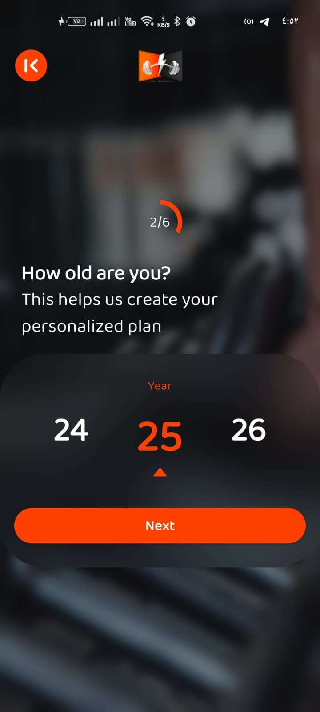
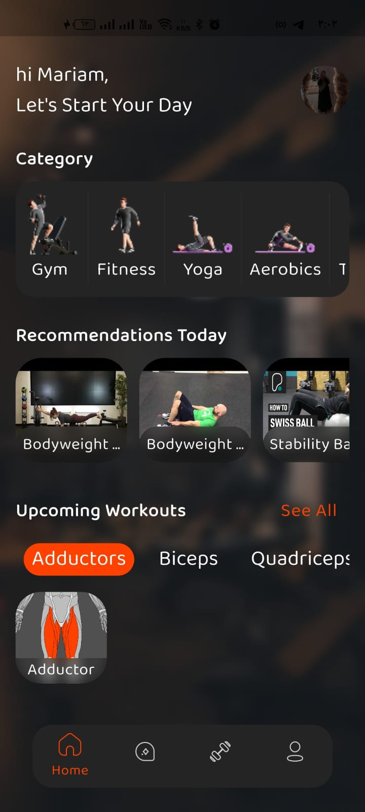

# Fitness Application

A comprehensive Flutter-based fitness application designed to help users achieve their health and wellness goals through personalized workout recommendations, meal planning, and AI-powered coaching assistance.

## 📋 Table of Contents

- [Overview](#overview)
- [Features](#features)
- [Architecture](#architecture)
- [State Management](#state-management)
- [Local Caching](#local-caching)
- [Backend Services](#backend-services)
- [CI/CD & Quality Assurance](#cicd--quality-assurance)
- [Testing Strategy](#testing-strategy)
- [Screenshots](#screenshots)
- [Getting Started](#getting-started)

## Overview

This fitness application provides users with a complete health and wellness solution, featuring personalized workout routines, nutritional guidance, and an intelligent AI coach that offers real-time fitness advice. The application is built using Flutter, ensuring a consistent and smooth user experience across multiple platforms.

## Features

### Authentication & Onboarding
- **Onboarding Experience**: User-friendly introduction screens that guide new users through the application's core features
- **Secure Authentication**: Complete authentication flow including login, registration, and password recovery
- **Forgot Password**: Secure password reset functionality with email verification
- **Change Password**: In-app password management for authenticated users

### Home & Dashboard
- **Personalized Dashboard**: Customized home screen displaying user-specific workout recommendations and progress
- **Quick Access**: Easy navigation to key features including workouts, meals, and coaching

### Workout Management
- **Exercise Library**: Comprehensive collection of exercises organized by muscle groups
- **Difficulty Levels**: Exercises categorized by difficulty to match user fitness levels
- **Workout Recommendations**: AI-powered suggestions based on user profile and goals
- **Exercise Details**: Detailed exercise descriptions with video tutorials

### Nutrition & Meal Planning
- **Food Recommendations**: Healthy meal suggestions organized by categories
- **Meal Details**: Comprehensive nutritional information for each recommended meal
- **Category-Based Browsing**: Easy navigation through different food categories

### AI Smart Coach
- **Intelligent Chat Interface**: Conversational AI coach powered by Gemini API
- **Personalized Advice**: Context-aware fitness and nutrition guidance
- **Chat History**: Persistent conversation storage for seamless user experience
- **Real-time Responses**: Instant feedback and recommendations

### Profile Management
- **User Profile**: Complete user information management
- **Edit Profile**: Update personal details, preferences, and fitness goals
- **Photo Upload**: Profile picture management with image picker integration
- **Logout**: Secure session termination

## Architecture

The application follows **Clean Architecture** principles combined with the **MVI (Model-View-Intent)** pattern to ensure maintainability, testability, and scalability.

### Clean Architecture Layers

1. **Presentation Layer** (`presentation/`)
   - UI components (Views/Screens)
   - View Models (Cubits)
   - Widgets and reusable components
   - Intent definitions

2. **Domain Layer** (`domain/`)
   - Business logic and use cases
   - Repository interfaces (contracts)
   - Domain models
   - Core business rules

3. **Data Layer** (`data/`)
   - Repository implementations
   - Data sources (remote and local)
   - Data models and DTOs
   - API client implementations

### MVI Pattern Implementation

The MVI pattern is implemented using the following components:

- **Model**: Represents the application state managed by Cubits
- **View**: Flutter widgets that observe state changes
- **Intent**: Actions triggered by user interactions, processed through `doIntent()` methods

Each feature follows this pattern:

```dart
// Intent
class HomeIntent {}

// Cubit handles Intent
cubit.doIntent(GetHomeDataIntent());

// State is emitted
emit(HomeSuccess(data));
```

This approach ensures:
- Unidirectional data flow
- Predictable state management
- Easy testing and debugging
- Clear separation of concerns

## State Management

The application uses **Cubit** (from the `flutter_bloc` package) for state management. Cubit provides a lightweight and straightforward approach to managing application state without the complexity of Bloc's event-based system.

### Key Benefits

- **Simplified API**: Easier to understand and use compared to Bloc
- **Type Safety**: Strongly typed states ensure compile-time safety
- **Testability**: Easy to test state changes and business logic
- **Reactive UI**: Automatic UI updates when state changes

### Implementation Example

```dart
class HomeViewCubit extends Cubit<HomeViewState> {
  Future<void> doIntent(HomeIntent intent) async {
    switch (intent) {
      case GetHomeDataIntent():
        await _getHomeData();
      // ... other intents
    }
  }
}
```

## Local Caching

The application implements local data persistence using **Hive**, a fast and lightweight NoSQL database for Flutter.

### Hive Implementation

- **Chat History**: All AI Smart Coach conversations are stored locally using Hive
- **Offline Support**: Users can access previous conversations without network connectivity
- **Data Models**: Custom Hive adapters for type-safe data storage

### Caching Strategy

- **Persistent Storage**: Conversation history persists across app restarts
- **User-Specific Data**: Chat history is filtered by user ID for security
- **Automatic Cleanup**: Corrupted data handling with automatic recovery

### Implementation Details

The Smart Coach feature uses `ConversationHiveModel` to store:
- Conversation metadata (ID, user ID, timestamps)
- Message history (role, text, timestamp)
- Conversation titles

This ensures a seamless user experience even when offline and provides fast access to previous coaching sessions.

## Backend Services

The application leverages **Firebase** as the primary backend infrastructure.

### Firebase Services

1. **Firebase Authentication**
   - Email/password authentication
   - Secure user session management
   - Password reset functionality

2. **Cloud Firestore**
   - Real-time database for user data
   - Workout and meal information storage
   - User profile synchronization

3. **Firebase Core**
   - Application initialization
   - Platform-specific configurations

### Additional Services

- **Gemini API**: Powers the AI Smart Coach functionality
- **RESTful API**: External API integration for exercise and meal data using Retrofit

## CI/CD & Quality Assurance

### Pre-commit Hooks

The project includes automated quality checks using pre-commit hooks:

- **Code Formatting**: Automatic code formatting using `flutter format`
- **Static Analysis**: Code quality checks via `flutter analyze`
- **Dependency Management**: Ensures dependencies are up to date

### Code Quality Tools

- **Flutter Lints**: Enforces Dart style guide and best practices
- **Analysis Options**: Custom linting rules for consistency
- **Coverage Reports**: Test coverage tracking with LCOV format

## Testing Strategy

The application employs a comprehensive testing strategy to ensure reliability and maintainability.

### Unit Testing

Unit tests cover:
- **Data Sources**: Remote and local data source implementations
- **Repository Logic**: Repository pattern implementations
- **Use Cases**: Business logic and use case validation
- **Cubits**: State management logic and state transitions

### Widget Testing

Widget tests verify:
- **UI Components**: Individual widget rendering and interaction
- **Screen Functionality**: Complete screen workflows
- **Form Validation**: Input validation and error handling
- **Navigation**: Routing and navigation flows

### Testing Tools

- **flutter_test**: Core Flutter testing framework
- **bloc_test**: Testing utilities for Cubit and Bloc
- **mockito/mocktail**: Mocking framework for dependencies

### Test Coverage

Tests are organized by feature following the same structure as the source code:
```
test/
  features/
    auth/
    home/
    smartCoach/
    ...
```

## Screenshots

### Onboarding

<div style="display: flex; gap: 10px; flex-wrap: wrap;">
  
  
  
</div>

### Authentication

#### Login
<div style="display: flex; gap: 10px; flex-wrap: wrap;">
  
</div>

#### Registration
<div style="display: flex; gap: 10px; flex-wrap: wrap;">
  
  
  
  
  
  
  
</div>

#### Password Recovery
<div style="display: flex; gap: 10px; flex-wrap: wrap;">
  
  
  
</div>

### Home

<div style="display: flex; gap: 10px; flex-wrap: wrap;">
  
  
</div>

### Food Recommendations

<div style="display: flex; gap: 10px; flex-wrap: wrap;">
  
  
  
</div>

### AI Smart Coach

<div style="display: flex; gap: 10px; flex-wrap: wrap;">
  
  
  
  
</div>

### Workout Management

<div style="display: flex; gap: 10px; flex-wrap: wrap;">
  
  
  
</div>

### Profile

<div style="display: flex; gap: 10px; flex-wrap: wrap;">
  
</div>

#### Edit Profile
<div style="display: flex; gap: 10px; flex-wrap: wrap;">
  
  
  
  
</div>

#### Change Password
<div style="display: flex; gap: 10px; flex-wrap: wrap;">
  
</div>

#### Logout
<div style="display: flex; gap: 10px; flex-wrap: wrap;">
  
</div>

## Getting Started

### Prerequisites

- Flutter SDK (version 3.7.2 or higher)
- Dart SDK
- Firebase project setup
- Gemini API key

### Installation

1. Clone the repository:
```bash
git clone <repository-url>
cd fitness_app
```

2. Install dependencies:
```bash
flutter pub get
```

3. Configure Firebase:
   - Add `firebase_options.dart` with your Firebase configuration
   - Set up Firebase Authentication and Firestore

4. Configure environment variables:
   - Create a `.env` file in the root directory
   - Add your Gemini API key

5. Generate code:
```bash
flutter pub run build_runner build --delete-conflicting-outputs
```

6. Run the application:
```bash
flutter run
```

### Running Tests

```bash
# Run all tests
flutter test

# Run tests with coverage
flutter test --coverage
```

---

